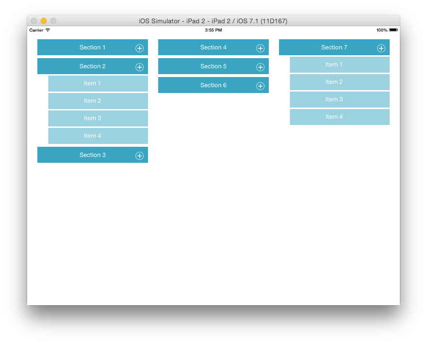
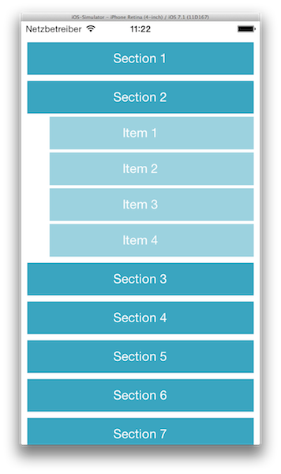

APLExpandableCollectionView
=========

UICollectionView subclass with vertically expandable and collapsible sections.

* animated expand and collapse animation
* scrolls expanded section to visible
* customizable flow layout for iPhone and iPad
* supports single and multiple expanded sections
* supports addition of sections

 

## Installation
Install via cocoapods by adding this to your Podfile:

	pod "APLExpandableCollectionView"

## Usage
In your storyboard, set the custom class of your UICollectionView to `APLExpandableCollectionView` and it's layout to custom, using the `APLExpandableSectionFlowLayout` class.

You might want to customize the collection view layout's `sectionInset`, `minimumLineSpacing`, `itemSize`, etc. to fit your layout needs and customize the cell appearance depending on whether it is a section's first cell, which is the "header cell", or a regular item. Check out the demo project as reference.

If you are not interested in expandable cells but would like to use a UICollectionViewFlowLayout which layouts it's sections and their items from top to bottom, left to right instead of left to right, top to bottom as displayed on the iPad screenshot, you could benefit from the `APLSectionTopToBottomFlowLayout`. It is inherited by the `APLExpandableSectionFlowLayout` but could be used on its own.

### Collapsing all expanded sections before expanding the next section

	self.collectionView.allowsMultipleExpandedSections = NO;
	
### Dynamically adding sections

Adds a new section after the existing sections and displays it as collapsed:

	[self.collectionView addExpandedSection:NO];
	
Adds a new section before the existing sections and displays it as expanded:

	[self.collectionView insertExpandedSection:YES atIndex:0];
